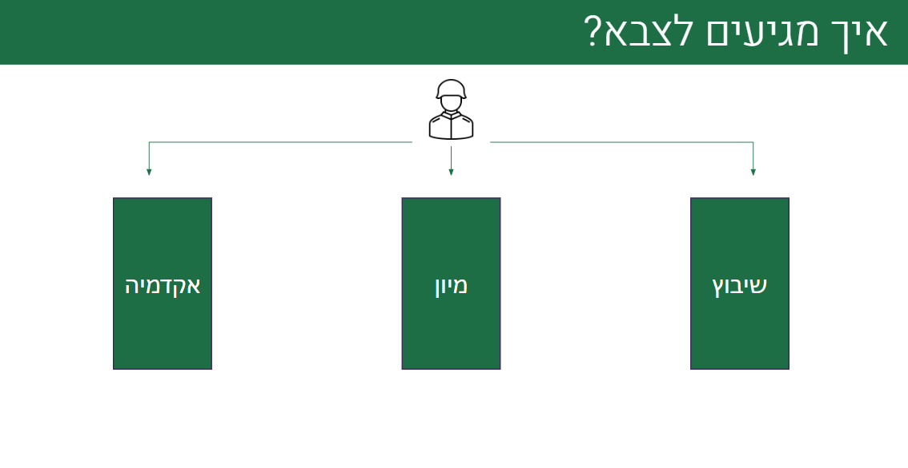

# איך להתקבל לתפקידים טכנולוגיים בצה”ל?

### הקדמה

טוב, אז אתם לומדים מדעי המחשב, או סייבר, או עושים בבית כמה תרגילים שמצאתם באינטרנט, או האמת עושים חידות סייבר שמצאתם באינטרנט. וביום אחד מן הימים, שמעתם בדרך לא דרך על זה שיש מסלולים בצה”ל ויחידות כמו 8200 81 9900 מצו”ב ממר”ם ועוד שמתעסקות במודיעין וטכנולוגיה. החלטתם שזה נשמע מגניב, ואתם רוצים להבין יותר! ואתם פשוט ניסיתם וניסיתם למצוא חומרים מספקים באינטרנט אבל כל אתר פשוט מכווין אתכם **לקורסים בכסף**, בלי מספיק מידע על מה זה בכלל מיון, איזה סוגי מיונים יש, הכל נראה כמו עומס אחד גדול בעין שאין לכם מושג מה הולך בתוכו. כל כך הרבה מיונים, כל כך הרבה מסלולים, כל כך הרבה יחידות, ותחום אחד ענק בשם טכנולוגיה.

אז קודם כל הירגעו, כי הנה אתם כאן, קוראים את המאמר שלנו, ונראה שכבר הבנתם שאנחנו כנראה “מכרה הזהב” שחיכיתם לו שלא ירצה למכור לכם קורסים בכסף, אלא פשוט מקום שרוצה לשתף את הידע שלא מספרים לנו בבית ספר, ולא במלש”ביות על כל המיונים הטכנולוגיים שקיימים בצה”ל. 

אנחנו, CyberIsrael, כאן לעשות לכן סדר בדברים!

במאמר זה אנחנו נתמקד **באילו תפקידים טכנולוגיים קיימים בצה”ל** **ומה הדרך להתקבל אליהם!**

---

טוב אז לפני שנדבר על איזה מיונים יש ואיך עוברים אותם אנחנו קודם כל נצטרך להבין איך נכנסים לצהל!

# איך מגיעים לצה”ל?

טוב, אז לצבא אפשר להגיע בשלוש דרכים שונות:

**שיבוץ** - צהל משבץ אותך למסלול או לתפקיד לפי צורכי הצבא בשיקול עם הצרכים האישיים והיכולות של כל מלש”ב

**מיון** - צהל בעזרת מיון בודק את היכולות של מלש”ב בתחומים ספציפיים ואם ישנה התאמה למסלול כלשהו המלש”ב עובר את המיונים בהצלחה ומתקבל למסלול או לתפקיד

**אקדמיה** - צהל יעביר את מלש”ב הכשרה אקדמאית במגוון סוגים כגון: תואר, שני תארים, הכשרה במכללה, כיתות י”ג י”ד, ולאחר מכן המלש”ב יגיע עם הכשרה אקדמאית וצה”ל ישתדל לתת לו שיבוץ בהתאם להכשרה האקדמאית שהוא עבר.

ברוב המוחלט של המקרים, התפקידים שנקבל דרך מיונים ודרך אקדמיה יהיו יותר “נחשקים” מתפקידים שנקבל משיבוץ. וזאת מהסיבה הפשוטה שכאשר אנחנו עוברים מיון זה מצריך יכולות מיוחדות כלשהן שאין למרבית האנשים, וכאשר אנחנו נעבור הכשרה אקדמאית אנחנו נהיה בעלי ידע שלא יהיה אותו לרוב האנשים.

**אז דרך מה אתם יכולים להגיע לתפקידים טכנולוגיים?**

**מבחינת שיבוץ**, יכול להיות שצהל ישבץ אותנו בתפקיד טכנולוגי! כן כן, יכול להיות מצב כזה! אבל לרוב זה יהיה לתפקידים זוטרים ולא לתפקידי מפתח בתוך יחידות… בדרך כלל תפקידים אשר לא דורשים ידע מעמיק במיוחד, ולא הכשרה ספציפית.

**מבחינת מיון** אנחנו נוכל להתמיין עבור מסלולים שהולכים לתפקידי מפתח בתחומים טכנולוגיים שונים!

**ומבחינת אקדמיה** נוכל ללכת למסלולים אשר יכשירו אותנו בתארים אשר קשורים לתפקידים טכנולוגיים ואז צה”ל ישתדל מאוד לשים אותנו בתפקידים שקשורים לתחומים האקדמיים שלמדנו. תארים אלה יכולים להיות במגוון סוגים כגון הנדסת תוכנה, מדעי המחשב, הנדסת מכונות, הנדסת חשמל, פיזיקה ועוד.

מה שנגזר מכך, זה שחשוב שנבין **ששיבוץ** זו לא הדרך שנגיע איתה לתפקיד טכנולוגי. ואם נרצה להגיע לתפקידי מפתח מעניינים וחשובים נצטרך להתאמץ ולהתקבל דרך מיונים עבור מסלולים ליחידות טכנולוגיות או להתקבל למסלול אקדמאי מתאים אשר בסוף המסלול נגיע לתפקיד טכנולוגי שמתאים להכשרה האקדמאית שלנו ביחידות שונות.

---

מעולה, אז הבנו שאנחנו צריכים להתמקד **במיונים ובאקדמיה** אם אנחנו רוצים להתקבל לתפקיד טכנולוגי כלשהו.
אבל העולמות האלה סופר גדולים ורחבים, ישנם אינספור מיונים, אינספור מסלולים, אינספור תוכניות אקדמיה, שכל אחד מוביל לתפקיד שונה ומיוחד שהוא לא בהכרח תפקיד טכנולוגי.

> [!TIP]
>
> כן, אנחנו יודעים, **יש יותר מדי בלאגן ויותר מדי עומס של מידע** בכל מה שקשור לצה”ל ומלש”בים. זו הסיבה שבשבילה אנחנו כותבים את אוסף המאמרים הנ”ל בקהילה שלנו.
> אנחנו מבינים את החששות, את הדאגות, את חוסר הודאות, **וזה למה אנחנו כקהילה פועלים כמה שיותר בשביל לתמוך במלש”בים אשר רוצים להגיע לתפקידים טכנולוגיים בצה”ל.**
>
> אם אתם רוצים להיות מחוברים יותר לאנשי הקהילה אשר עוסקים בתחומי הטכנולוגיה, מחשבים וסייבר, אם אתם רוצים להשתפר מקצועית, אם אתם רוצים להכיר עוד אנשים כמוכם בעלי זיקה > ותשוקה לעולמות הטכנולוגיים ולשתף איתם פעולה, אם אתם רוצים להיחשף לעוד תחומים טכנולוגיים חדשים שיעניינו ויסקרנו אתכם 
> **אתם מוזמנים להצטרף אלינו לCyberIsrael - קהילה ללא מטרות רווח!**
>
> **בשביל להצטרף אתם יותר ממוזמנים להיכנס לרשתות החברתיות שלנו בחינם לחלוטין**
> - Whatsapp
> - Instagram
> - Tiktok
> - Discord

טוב אז בואו נעשה סדר. בשני החלקים הבאים אנחנו עומדים להסביר לכם על כל התפקידים הטכנולוגיים שאפשר להגיע אליהם דרך **מיונים** ודרך **אקדמיה,** וכמובן גם נסביר איך אפשר להתכונן ולהתקבל אליהם.

# מיונים

טוב, אז מבחינת מיונים יש לנו 4 מסלולים מרכזיים שבעזרתם ניתן להגיע לתפקידים טכנולוגיים משמעותיים.

**גאמ”א סייבר, שחקים, כלל חמ”ן, אשכול מקצועות המחשב**

ההבדל העיקרי בין ארבעת המסלולים חוץ מהתפקידים שאליהם ממיינים המסלולים הוא שלמסלול **שחקים, כלל חמ”ן ואשכול מקצועות המחשב** כמעט ולא דרוש ידע קדום, זאת לעומת **גאמ”א סייבר** אשר דורשים ידע קדום מאוד רחב.

הבדל זה הוא משמעותי וחשוב עבור מלש”בים מכיוון שזה אומר שהמיון היחידי שאפשר להשפיע על תוצאותיו בצורה משמעותית על ידי השקעה מראש זה **גאמ”א סייבר.
לכן גם המאמר על גאמ”א סייבר גדול בהרבה משאר המאמרים!**

****נפרט על כל מסלול בהרחבה במאמרים הבאים:

[איך להתכונן למיוני גאמ”א סייבר?](/articles/gamma-cyber-selections)

[מה זה שחקים?](/articles/what-is-shchakim)

[מה זה כלל חמ”ן?](/articles/what-is-klal-haman)

[מה זה מיוני אשכול מקצועות המחשב?](/articles/what-is-computer-professions-cluster)

# אקדמיה

מבחינת אקדמיה יש לנו 4 סוגי מסלולים שונים שאפשר להגיע דרכם לתפקידים טכנולוגיים משמעותיים:
**עתודה אקדמית, עתודה צבאית, אקדמיזציה, י”ג + י”ד**

נפרט על כל מסלול בהרחבה במאמרים הבאים:

[מה זה עתודה אקדמית?](/articles/what-is-academic-reserve)

[מה זה תלפיות, חבצלות וארזים?](/articles/talpiot-havatzalot-arazim)

[מה זה אקדמיזציה?](/coming-soon)

[מה זה י”ג וי”ד?](/coming-soon/:grades13-14)

# דגשים חשובים

בין אם קראתם את המאמרים על המסלולים או לא, זכרו שיש 4 דגשים חשובים שאתם צריכים לזכור איתכם במהלך תקופת המיונים שלכם לצה”ל.

1. **אל תינעלו אך ורק על כיוון אחד** - לא תמיד מקבלים את מה שרוצים, והסטטיסטיקה לא בעד המתמיין הממוצע בצה”ל. זכרו שאחוזים בודדים מתקבלים בסוף למסלולים הנחשקים ביותר, ולכן אתם צריכים לא להינעל על כיוון אחד ולנסות כמה שיותר מיונים למסלולים. כן, אפילו אם אתם לא אוהבים את אופי המסלול.
קודם כל, לכו תדעו, אולי אתם בסוף תאהבו את המסלול שאתם הולכים אליו ואולי רק למיונים לא התחברתם…
בנוסף, אם אתם רוצים לשרת שירות טכנולוגי, תצטרכו להמר וללכת על מיונים שלא הכי מושכים לכם את העין כי אתם אף פעם לא תדעו מי יסתכל עליכם ומי ימיין אתכם.
כמות האנשים שהתמיינו למסלול כלשהו ובמקרה התקבלו למסלול אחר בגלל המיונים הוא לא קטן.
**כל מיון פותח דלת בפניכם**.
2. **תעדפו אופציות כמה שיותר מוקדם** - ככל שאתם תדעו יותר מוקדם לאיזה מסלול אתם רוצים ללכת, ככה יהיה לכם יותר זמן ומשאבים להשקיע בקבלה למיון. תנסו לחשוב עם עצמכם כמה שיותר לאיפה אתם רוצים ללכת, מה יותר מושך, איזה מקצוע אתם יותר מתחברים אליו. יש אנשים שמתכוננים שנים למיונים, והם בסוף אלה שמצליחים גם לעבור אותם.
תעדפו לעצמכם אופציות כמה שיותר מוקדם ותדעו מה המסלול שאתם הכי רוצים להגיע אליו בצה”ל!
3. **אל תתאכזבו לעולם מכשלונות** - אין מלש”ב שעבר מיונים לכל מסלול אפשרי בצה”ל. אם אתם מכירים מישהו כזה, מוזמנים לומר לו שיכתוב לנו. תזכרו שאם לא עברתם יום סיירות זה בסדר גמור, אם לא עברתם סדנת תלפיות זה גם בסדר, אם נפלתם בשלב הראשון של שחקים זה סבבה לגמרי, ואפילו אם נפלתם בשלב הראשון של גאמ”א זה לגמרי בסדר. כשלונות תמיד תמיד תמיד קורים. והמלש”בים שנתנו לזה להשפיע עליהם, הם אלה שבסוף הגיעו לתפקידים שהם לא שמחו מהם.
לעומת זאת, המלש”בים שהבינו שזה בסדר גמור להיכשל, ולא נתנו לשום מיון לשבור אותם, כיום ברובם נמצאים במקום שהם מאוד שמחים ממנו.
